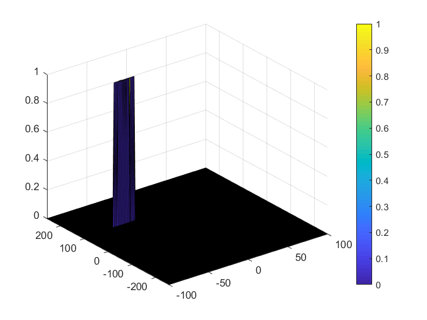

# SFND_Radar_Target_Generation_and_Detection

Welcome to the final project of the radar course. Let's take a look at our program schematic to see what we already have accomplished and what's still missing.


In this final project, you will implement the missing parts in the schematic. To do this, you will complete four major tasks: 
1. First, you will define FMCW Waveform Design.
2. Second, you will be simulating the signal propagation and moving target scenario. 
3. Third, you will implement the 1D FFT on the Mixed Signal.
4. Lastly, you will implement the 2D CFAR on the output of 2D FFT

2D CFAR
-------
```
Implement the 2D CFAR process on the output of 2D FFT operation, i.e the Range Doppler Map.
```
Implementation steps for the 2D CFAR process.
1.  pick the number of guard/train cells. ! choosed them based upon try and error:
    Tr = 10;
    Td = 8;
    Gr = Gd = 4;
2. Initialize the 2d CFAR list with zero so we can suppress non-thresholded cells at the edges.
3. Slide the cell under test across the complete matrix.
4. For every iteration, sum the signal level within all the training cells
5. Then, average the summed values for all of the training cells used
6. check if the Average is more than the threshold so assign 1 to CUT cell in output matix.

Final result can be shown below:

